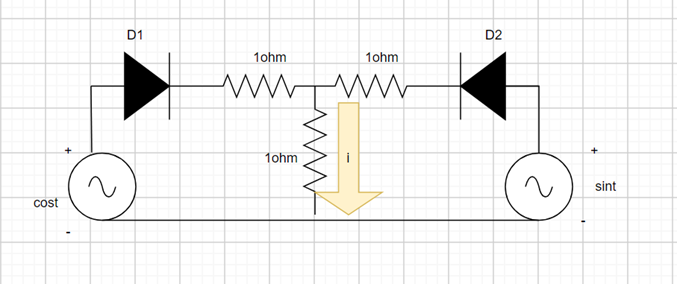

# JNU Introduction to Electrical and Electronics (IEE) 2023

# Links:

1. Interactive Session with Aastha Agarwal (Intel) :

[https://youtu.be/hJSK8X1nFTQ?si=QjqLf0x1uwcva5qf](https://youtu.be/hJSK8X1nFTQ?si=QjqLf0x1uwcva5qf)

1. **Student Project’s List** 

Only the video Links are attached, ppt and pdfs are with me.

**Group Names (number of members)**

|  | **Project Title** | **Video Link**  |
| --- | --- | --- |
| Psyence Ducks (6 members) CountOnMe | Arduino-based  hardware hack for aiding and diagnosing Dyscalculia | [https://www.youtube.com/watch?v=h9dDgZQLaus](https://www.youtube.com/watch?v=h9dDgZQLaus) |
| Electric Minds (6) |  | [https://drive.google.com/drive/folders/10YwUqN16SpL-ZKC6IklPNgEbkN2PSPdw](https://drive.google.com/drive/folders/10YwUqN16SpL-ZKC6IklPNgEbkN2PSPdw) |
| Technohol (4) | PASSWORD PROTECTION USING ADRUINO | [https://www.youtube.com/watch?v=I6pu-Bz8x1s](https://www.youtube.com/watch?v=I6pu-Bz8x1s) |
|  Megatrons (6) |  SUSTAINABLE POWER GENERATION |  |
|  The Rock (5) |  |  |
| The Enduring Squad(6) | Full wave rectifier | [https://www.youtube.com/watch?v=oJuPg3OUn_I](https://www.youtube.com/watch?v=oJuPg3OUn_I) |
| Quarks and Sparks (4) | Electronic Voting Machine | [https://drive.google.com/file/d/1-TpcPXEHWtkRwPle5rVPrWs8zGwVsGma/view](https://drive.google.com/file/d/1-TpcPXEHWtkRwPle5rVPrWs8zGwVsGma/view) |
| Divergent(3) | WALKIE TALKIE | https://docs.google.com/presentation/d/16fpQNAxKsj_1fSMbQmHdjx1K4J-kyNY8/edit#slide=id.p1 |
| Knight Riders | Remote control Car | [https://clipchamp.com/watch/NfzzuaeUQF8](https://clipchamp.com/watch/NfzzuaeUQF8) |
| The Sigma ones(6) | Bone conduction speaker/headphones | https://drive.google.com/file/d/1yG_-_gASXieUn-RCVGMdq4ujytG2FGNI/view |
| Electric Wizards(3) | Automatic Street Light Controller | [https://www.youtube.com/shorts/DErmwQzEWSc](https://www.youtube.com/shorts/DErmwQzEWSc) |
| Watt's Up (6) |  | [https://www.youtube.com/watch?v=QmWN48gR_2Y](https://www.youtube.com/watch?v=QmWN48gR_2Y) |
| Techno Vision(6) | Joule thief Circuit | [https://www.youtube.com/watch?v=B1LkzZUqCEU](https://www.youtube.com/watch?v=B1LkzZUqCEU) |
| Wire not?(3) | Rock Paper Scissors Robot | [https://www.youtube.com/watch?v=tnUAHs4cCVw](https://www.youtube.com/watch?v=tnUAHs4cCVw) |
| Settings (6) | TEMPERATURE CONTROLLED DC FAN | https://drive.google.com/file/d/18Jk5V_Sivy7VdXrGyZZuCASx7IA65c1K/view |
| Connections(3) | Wireless Power transmission | https://docs.google.com/presentation/d/1Mho49SqKc9aeHMuzB0L_fHUdUu7AFKpz/edit?usp=drivesdk&ouid=114644889903982867735&rtpof=true&sd=true |
| The Reinforcers | DOOR BELL | https://docs.google.com/presentation/d/1-c3G4kNHpCxXORhEsPrDyBmZzGypgEADgBLV9oX9nfE/edit#slide=id.gc6f73a04f_0_0 |
| Tech Turtles (5) | Water Level Indicator | [https://www.youtube.com/watch?v=XwFS3Z8oQjs](https://www.youtube.com/watch?v=XwFS3Z8oQjs) |
| The shockers(6) | HOME AUTOMATION USING ESP 32 | [https://photos.onedrive.com/share/379CA9B65C49ECFA!2040?cid=379CA9B65C49ECFA&resId=379CA9B65C49ECFA!2040&authkey=!AAvM_d9g29y0LRA&ithint=video&e=p5nTI4](https://photos.onedrive.com/share/379CA9B65C49ECFA!2040?cid=379CA9B65C49ECFA&resId=379CA9B65C49ECFA!2040&authkey=!AAvM_d9g29y0LRA&ithint=video&e=p5nTI4) |
| Amped Up(6) | Morse Code Converter | [https://www.youtube.com/watch?v=GTYj-KnmP98](https://www.youtube.com/watch?v=GTYj-KnmP98) |
| Tech Bees(5) | Anti Sleep Alarm | [https://www.youtube.com/watch?v=BQvk4KOtbl0](https://www.youtube.com/watch?v=BQvk4KOtbl0) |

# **Major Exam**

**IEE**

**Date: 15 June 2023                                                                            Total Marks: 50 marks**

**Please read the following instructions carefully before starting the examination:**

1. **There are three sections(Section A,B,C), attempt all sections.**
2. **All diagrams, graphs, and charts should be drawn neatly and clearly labeled.**

**Section A: All questions are Compulsory [5 * 3 = 15 marks]**

1. What is Early Effect in transistors? What are the consequences of it? **[2+1]**
2. Explain the Amplifier action of a BJT (bipolar junction transistors), in details. **[2+1(dig.)]**
3. Explain the input and output characteristics of the common collector configuration. **[5+1.5]**
4. For a certain D-MOSFET, IDSS = 10 mA and VGS (off) =– 8 V. (a) Calculate ID at VGS = – 3 V. (b) Calculate ID at VGS = +3 V. ** [1.5 + 1.5]**
5. Fill in the blanks. **[1+1+1]**
    1. **(15)10 = (__)8**
    2. **(2023)10 = (__)16**
    3. **(BAD)16 = (__)02**

**Section B: Do any 5 questions [5 * 6 = 30 marks]**

1. Design a NOR GATE Using NAND Gates and NAND Gate using NOR Gate. Show the Truth Table for both. **[3+3]**
2. Explain the difference between Toggling and Race Around condition in JK flip-flop. What would you suggest to avoid these conditions? Draw the circuit and explain with timing diagram. **[1+1+4]**
3. Explain all the four cases of SR flip-flop (Set, Reset, memory, invalid) with proper diagram and truth table. **[6]**
4. Solve the following: **[2+4]**
    1. ****F (A, B, C, D) = A̅BC̅D + ABC̅D̅+ ABC̅D + ABCD + ABCD̅+ AB̅CD + AB̅CD̅
    2. ****F (A, B, C) = Σm(0, 1, 6, 7) + Σd(3, 5). Does the reduced output, resembles any gate outputs like OR, AND, NOT, NAND, NOR XOR, X-NOR? Draw that logic circuit of reduced output.
5. Solve the following problems: **[3+3]**
    1. For a certain transistor, IB = 20 μA; IC = 2 mA and β = 80. Calculate ICBO
    2.  Using diagrams, explain the correctness of the relation ICEO = (β + 1)*ICBO
6. A full-wave rectifier uses two diodes; the internal resistance of each diode may be assumed constant at 20 Ω. The transformer r.m.s. secondary voltage from centre tap to each end of secondary is 50 V and load resistance is 980 Ω. Find: (i) the mean load current (ii) the r.m.s. value of load current. **[2(exp.+dig.)+2+2]**
7. What is the full form of MOSFET? How many terminals MOSFET consists of? Write the differences between MOSFET and BJT. Write at-least 1 applications of each. **[1+1+2+2]**

**Section C: [1 * 5 = 5 marks]**

1. Write answer carefully. **[1+1+3]**
    1. Write your Project title, that you have done for class project and a small abstract (Introduction) about the project.
    2. Write the specification of the project.
    3. Explain the working principle of your project with the help of circuit diagram(or diagram, where applicable).

# Minor Exam

Minor Question Paper

Total Marks: 30

Section 1:

[ 1 Marks each. Compulsory] [10 Marks]

1. Assume the diodes to be ideal, what is the value of current “i”?
2. Show the effect of temperature on fermi level in n-type semiconductor (only diagram).

1. What are the majority and minority carriers of p-type and n-type semiconductors?
2. Evaluate the Fermi function for energy “kT” above the Fermi Energy.
3. Draw the circuit for a Negative Clipper Positive Bias, with the wave forms.

Section 2:

[ 5 Marks each. *Answer any 4 questions*.] [20 Marks]

1. Explain the construction and working of diode. Plot the *V-I* characteristics of diode operating under forward bias and reverse bias mode.
2. Briefly explain the following diode modelling (show the V-I plot):
    
    (a) Constant Voltage modelling
    
    (b) Piece Wise Linear modelling
    

(c) Non-Linear modelling

1. Explain the working of full wave bridge rectifier (circuit diagram and input-output waveform). State the efficiency of half-wave and full wave rectifiers. What is its main advantage over full wave center-tap rectifier?
2. Derive the average current through R, PIV of diode D1 and waveform of diode voltage (during forward and reverse bias) for the given circuit (assume diode D1 is ideal):

1. Write short notes on:
    
    (a). Clamper Circuits
    
    (b). Clipper Circuits
    
2. A half wave rectifier with R = 1 KiloOhm, is given an input of 10V peak from step-down transformer. Calculate the D.C. voltage and the load current for ideal and silicon diode.   
3. Draw the simplest circuit consisting of resistors and diodes to obtain output waveform. [Consider we are giving sinusoidal waveform as input

